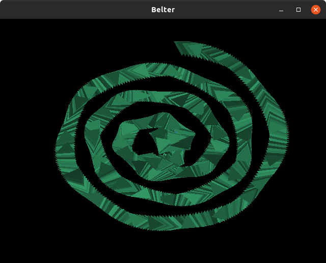

# Belter

A videogame with 2D vector graphics, reminiscent of Asteroids.

## Status

Just started. It isn't a game yet. 1,000 green triangles meander around the
screen uncontrollably.

## Prerequisites

For now, prerequisites must be manually installed.

Debian/Ubuntu:

    sudo apt-get install -y freeglut3-dev

Fedora/CentOS/RedHat:

    sudo yum install freeglut-devel

## To run

For now, is only runnable from source.

Create and populate virtualenv:

    make setup

Then run with:

    ./run

## Instructions

F10 to toggle windowed/fullscreen, and cycle through available monitors.

That's all that works right now.

## TODO

### features
* perspective transform (fixed)
  * Do the perspective transform using a matrix set `on_resize`
    https://github.com/adamlwgriffiths/Pyrr/blob/master/pyrr/matrix44.py
      window.on_resize calls
      core.on_win_resize sets
      render.win_size
          which calcs a proj matrix
              use some opengl 'ortho' call to generate?
                check out moderngl examples
              or py2d
              or some other dependency :-(
              or just construct it manually?
          which is set in the uniform at start of render
* camera zoom, offset, orientation (per frame)
  * requires a camera model object
  * remove existing 'zoom'
  * redo using a view matrix
* consider replacing entity position/orientation with a model matrix
* new pyglet and pyopengl are out, now compatible with each other
* shapes are also added to pymunk
* shapes need offsetting to their center of mass
* shapes may consist of polygons, which are tessellated into triangles
* screenshot
* starfield v1
* bodies are rendered as an outline, with a black interior
  https://blog.mapbox.com/drawing-antialiased-lines-with-opengl-8766f34192dc
* some sort of glow thing like gravitar2?
* keys to control ship
* Both
  * `ctx.vertex_array` `index_element_size` arg and
  * indices struct.pack 1st arg
  should grow as number of indices exceeds 255, 65535.
  Maybe `get_vao` should decide on element size, and pass it in?
  Or, better, they each call an `element_size_int` and `element_size_char`?
* A large asteroid? Smaller ones orbit it?
### performance
* performance test
  * we seem to get periodic slowdowns, what's that about?
* `Render.get_packed_vertices`: struct.pack on asterisked iterable must be slow.
  * try array module?
  * try ctypes slice assignment from gloopy?
  * try the answers from this page:
    https://stackoverflow.com/questions/9940859/fastest-way-to-pack-a-list-of-floats-into-bytes-in-python/55081769#55081769
  * pad buffers to 4-byte alignment. (eg 4th color byte)
* single interleaved buffer?
  Was faster in 2013, for cache reasons.
  Comment suggested it no longer matters since 2016.
* waiting at end of Render.draw is probably suboptimal.
  Can we wait before rendering the next frame, instead?
  I tried it quickly, seems to actually reduce framerate by 10fps. Why?
* pre-render all objects to a bitmap, draw that.
### design
* Probably already needs a total redesign from a 'hexagonal' viewpoint.
  What are our business logic units?
* render should store vao keyed on id(shape), not id(entity),
  then multiple entities could use same vao,
  either simultaneously or sequentially.
### deployment
* Produce a linux executable:
  * generate requirements/main.txt, using a fresh virtualenv
  * Install our code using `pip install --no-deps .`
* make a github release
* Ask someone to download and double click
  Can I do this in an LXC?
* e2e test which builds the executable, runs with --selftest
* copy stuff back into project template

# Discussion

### Goals

Put high value asteroids into the fab intake?
* how to discern high value?
  * color?
  * reuse "Asteroids" background tones as proximity guage?
* why?
  * provided with raw material, the fab makes things?
    * fuel?
    * extra life?
  * unlocks progress to next level?
    * need to fill the fab?
      Implies same amount for each level.
      So maybe harder levels make high value asteroids harder to come by?
      But that seems unrewarding.
    * need to find all high value asteroids?
      Better, I think.
      Levels could then have varying amounts of high value asteroids.

### Landing / Docking

Conventional landing on the tail-fins:

    ____A____

But this means we can't use main engine for thrusting against the thing
we've landed on / docked with.

One solution is, after landing, the whole ship (or just its engines?)
gimbal around 180 degrees. Then the main engines are pointing at the sky.

But it seems simpler, both gamedev wise and in real life, in a low grav
environment, to land on (or dock with) things nose-first:

    ____V____

This looks a bit top-heavy, and weak at the point of contact. So thicken it
up at the bottom by unfolding landing gear. Which is cool anyhow:

    ____X____

Then main engines can thrust against the asteroid we've landed on. Cool!

This is worse than a thrust-style tether, in that wiggling through gaps
with an asteroid in tow isn't as hair-raising. But it is better, in that the
asteroid moves in freefall, as opposed to a tethered spiral, and hence its
path can be more precisely and meaningfully predicted, both by the player, and
by the game's HUD, for example in plotting orbits, predicted paths, or
estimated points of impact.

## Framework

Figure out framework to use:
  1. Use pyglet, using default opengl 3.0, like gloopy.
     Working example in moderngl mgl_new_example_pyglet.py
         Without fps, window is black,
         but does render briefly when you hit escape.
         renders fine if you add some pyglet draw call.
         Seems like some pyglet render is needed to make window flip, maybe?
     'moderngl' defaults to gl 3.3. What features don't work at 3.0?
     * Least work.
     * Know how to do it.
     * Can use pyglet's new 'graphics' module to render meshes.
     * Wish I could use some more modern open gl.
  2. Ask pyglet to give me >3.0 (gives 4.5)
     Pyglet sprite, label, etc do not work like this.
        Would have to reimplement all drawing operations from scratch.
     And window resize calling gl.glMatrixModel also barfs
        Can we work around that? Give our own window.on_resize, etc?
     * Most work
     * Get to use modern opengl
     * May be a little faster?
Let's start with 1, but using as modern GL as we can.
So no 'modelview' transform, use... er, whatever the equivalent is. Uniforms?
Update: Have ended up doing 2 instead. ModernGL expects 3.3, and I wasn't
brave enough to drop down to 3.0, fearing features I want might be missing.

## modern opengl 101

model (local, object) space
    model transform
world space
    view transform      (model.view = modelview, aka M)
view (camera, eye) space
    projection transform (P)
clip space (normalized) (output of vertex shader)
    clipping, then
    viewport transform
screen space (pixel co-ordinates)

* What happens to our current code when we request opengl 4.5?
    * fps display raises errors calling gl fn that doesn't exist
      Fixable by removing fps_display
    * default `window.on_resize` raises errors calling gl fn that doesn't exist
      Fixable by adding our own on_resize
    * Window is black until exiting. Is it not flipping?
      We need to wait for draw operations to finish after each frame

## interleaved arrays
Separate arrays for verts & colors, vs one interleaved array?
Am I going to want to use one buffer of vert positions
with different buffers of colors? Sounds fun, but I don't think so:
* I don't plan to have hordes of same shape / different color entities
* If I did, the memory savings of de-duping the verts is unimportant
* But, the time saving of creating and sending to GPU is.
* But but, if mutating the colors, I'd probably want to do that on
  an entity-by-entity basis, rather than for all entities in unison.
So, it sounds like a possible but unlikely future performance enhancement.
Hence, ignore it for now.
Conclusion: Use interleaved arrays, unless they prove awkward/slow to
create.

